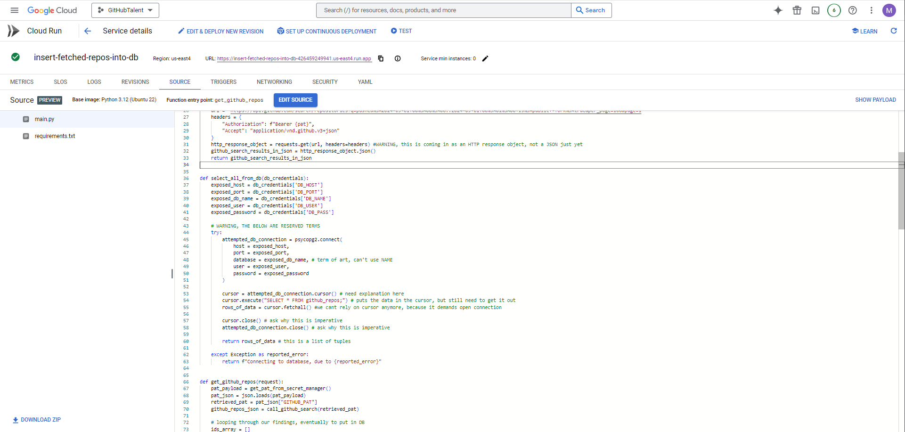
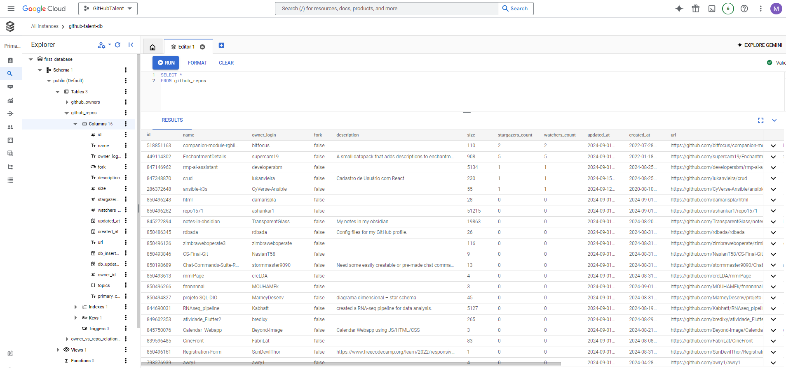
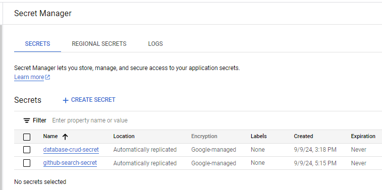

# I. Author's context:
- While doing 2 data analytics projects, I pulled data local machine on an ad hoc basis. That approach lacked the 1. automation 2. reliability 3. scalability 4. integration ease and 5. security needed for a continuous data streams.
- This __data engineering__ project resolves all concerns by __upgrading to a 100% cloud-based solution__.
- The resulting tool helps technical recruiters identify candidates with relevant GitHub repos.

# II. What I built/New tech used:
## 1. Fully cloud-based ETL pipeline (80%)
### Extraction
Separate processes each calls different GitHub APIs to ingest data about recently updated repos and their owners' profiles. Runs said scripts in __Google Cloud Run__ instead of a local machine i.e. no downtime from machine crashes, power outages, or internet disruptions.

Stores passwords and API keys in secure and scalable ways using __Google Cloud Secret Manager__ instead of ad hoc environment attributes.
 
 
### Storage
Runs an expandable Postgres database in __Google Cloud SQL__, which is no longer limited by my local machine's disk space.

Database credentials safely stored in __Google Cloud Secret Manager__.
 
 
### Transformation
SQL scripts read repo information out of database, transform the data with lead-scoring, and creates a list of repo owners/authors to approach.   
 
 
### Load/Data Visualization
In current rendition, loads grids for:
* which profiles a recruiter might chase 
* viable contact methods

At scale, will consider __BigQuery__ for larger datasets and __Looker Studio__ for more complex visualizations.

 
 

### Automated Task Management

## 2.Automation (20%)
Uses __Google Cloud Scheduler__ to invoke aforementioned processes on a schedule and handle transient failures

 
 

# III. Defining "good" engineers (just an illustration, not set in stone):
1. have relevant repos:
   a) tags match my searched keywords e.g. "machine learning"
   b) repo was updated recently
   c) repo has at least 10 commits, a minimum file size, and was created at least 4 days ago, as a heuristic for intensity and depth 
   d) repo is externally validated by at least 1 star

2. who are accessible:
   a) profiles are from an individual, not an organization
   b) GitHub profiles show a method for contacting e.g.e-mail address, personal web site, LinkedIn pages, or Twitter handles
   c) priority given to profiles with 2 or more relevant repos 
   d) profiles deprioritized if too many followers or stars

that have relevant skills, but other recruiters haven't seen yet.

# IV. Screenshots (illustrative, but not comprehensive):

Google Run executes my script, calling a GitHub API to extract information about repos updated within a 60-second timeframe

These are the repos store in a PostGres database on Google Cloud SQL

A second script now extract repo OWNER data

Instead of storing credentials on my local machine's environment, I store database passwords and GitHub's authentication tokens in GCP Secret Manager.

# V. Learnings:
- I had to go through 4 different project ideas/data sources before I could find one where I wasn't limited by the scope of data, the volume of hits permitted, and the financial cost
- I built static web sites in the 1990s when deployment was a lot simpler. Publishing a web site to the web was simplying drag-and-dropping files into an FTP server, so I had trouble envisioning how modern day DevOps was a full-time job. That changed as soon I opened up Google Cloud Platform and started reading the summaries.
- To a non-technical, I wish someone would have explained AWS/GCP to me as the "GoogleSuite of DevOps". That would have helped me contextualize this a lot faster.
- There are waaaaay more configurations than I could have possibly imagined, I would have been helpless without ChatGPT to guide me
- In GoogleSuite, users don't need to manually link modules together and set permissions. That's not the case in GCP.
- Serverless tools like Google Cloud Function have no "preview" button, forcing long wait times between source code iterations
- So many challenges getting the Google Cloud Function to read database from Google Cloud SQL:
  - adding role + permissions
  - adding firewall
  - swapping to postgres from mysql, and the port that goes with it
- Google Scheduler has no way of storing variables, which could be problematic for having the right start times on API searches. One way I could solve this is by storing dates in a database table.

# VI. Potential improvements:
>**Product/UI:** 
- The priority behind this project was to prove technical feasibility, not product quality or engineering extensibility i.e. get a simple ETL working in the cloud ASAP. Given enough time, I would have had a far more complex lead-scoring system
- Totally impractical today, but eventually I could integrate this with an interactive web site where users could select keywords, set their own groupings, and filters. For example, maybe a user wants to see any repo authors with the topic tag "Minecraft"
- We could add word clustering e.g. a recruiter searches for repos demonstrating "AI" and my tool catches repos with "Artificial Intelligence". Now we need to debate on whether such a generic term should also catch specifics "Machine Learning", "ML", and "computer vision"

>**Engineering:** 
- Functions can and should be refactored to be more segregated and modular. For example, it might make sense to split the first function up across multiple files where one dedicated file is for Secret Manager to retrieve the Personal Authentication token.
- It was tedious testing out my code inside of GCP because of the delays from re-deploying Cloud Run

>**Tools** 
- BigQuery
- Looker Studio (formerly known as GCP Data Studio and not to be confused with Looker BI, which is more enterprise)